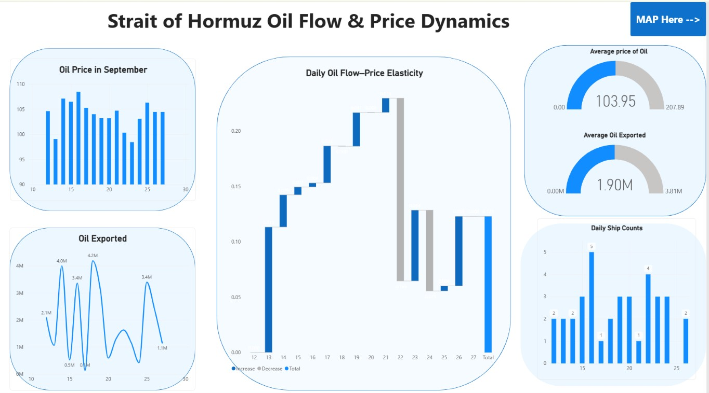

# HORMUZ WATCH — Hormuz Maritime Market Intelligence

ShellHacks hackathon project. We track tanker traffic in the Strait of Hormuz with real AIS data, detect vessels crossing a virtual gate, and compare it with oil flow and Brent prices in a Power BI dashboard.

## Dashboard

[View the interactive Power BI dashboard](https://app.powerbi.com/view?r=eyJrIjoiMzA5Y2I1NWMtNmY4NC00ZWMwLWExNmMtMzEwZTk1NzhkMzk1IiwidCI6ImFjNzllNWE4LWUwZTQtNDM0Yi1hMjkyLTJjODliNWMyODM2NiIsImMiOjF9)



Daily tanker traffic, estimated oil flow, Brent price and oil flow–price elasticity (12–27 Sep 2026), with tanker locations on Azure Maps. Details: [`dashboard/README.md`](dashboard/README.md).

## Workflow

```
1. Collect AIS        VesselAPI ──► samples/ (raw snapshots, git-ignored)
2. Vessel types       VesselAPI vessel lookup ──► tanker / not tanker / unknown
3. Detect crossings   normalizer ──► gate-crossing detector ──► SQLite
4. Market data        IMF PortWatch (daily transits) + FRED (daily Brent)
5. Export             build_excel.py ──► Excel: Tanker | Oil | Oil Price (joined on Date)
6. Dashboard          Power BI (Import) + Azure Maps ──► published link above
```

| Step | What happens | Code |
|---|---|---|
| 1. Collect AIS | Pull vessel positions in a Hormuz bounding box, now and for past days | `src/vesselapi_recorder.py`, `scripts/fetch_history.py` |
| 2. Vessel types | The position feed has no vessel type, so each MMSI is looked up once; anything unconfirmed stays *Unknown* | `scripts/fetch_vessel_details.py` |
| 3. Detect crossings | Normalize positions, drop glitches and duplicates, check if a vessel's path crosses the gate → `INBOUND` / `OUTBOUND` | `src/normalizer.py`, `src/crossing_detector.py`, `src/pipeline.py`, `src/database.py` |
| 4. Market data | Daily Hormuz transits and trade volume (IMF PortWatch), daily Brent spot price (FRED/EIA) | `scripts/fetch_portwatch.py`, `src/brent_loader.py` |
| 5. Export | One Excel file for Power BI, one row per day or vessel, empty cells = not available | `scripts/build_excel.py` |
| 6. Dashboard | Power BI report with KPIs, trends, elasticity and a tanker map | `dashboard/hormuz_dashboard.pbix` |

## Key results

| Metric | Value |
|---|---|
| Real AIS window | 26/9 21:55 → 27/9 05:10 UTC |
| Raw records → unique positions | 683 → 266 |
| Vessels tracked | 14 |
| Real gate crossings | **1** — AL- NOOR (MMSI 616002462), 27/9 03:33 UTC, `OUTBOUND` |
| Simulated demo | 21 positions, 3 vessels, 2 crossings (1 per direction) |
| Automated tests | 125 passed |

## Run it

**Setup** (on Mac use `python3`, not `python`)
```bash
python3 -m pip install -r requirements.txt
```
```bash
cp .env.example .env
```
Put your VesselAPI key in `.env` (`VESSELAPI_KEY=`, from https://dashboard.vesselapi.com/). `.env` is git-ignored.

**Try it without an API key** (simulated data)
```bash
python3 -m src.pipeline --snapshots demo/simulated_tracks.jsonl --detector src.crossing_detector:CrossingDetector --gate "56.1,26.10,56.1,26.80"
```

**Full workflow with real data**

1. Collect AIS:
   ```bash
   python3 -m src.vesselapi_recorder --once
   ```
   ```bash
   python3 scripts/fetch_history.py
   ```
2. Vessel types:
   ```bash
   python3 scripts/fetch_vessel_details.py --max-calls 20
   ```
3. Detect crossings:
   ```bash
   python3 -m src.pipeline --detector src.crossing_detector:CrossingDetector --gate "56.1,26.10,56.1,26.80"
   ```
4. Market data + 5. Excel export (PortWatch and Brent are downloaded automatically):
   ```bash
   python3 scripts/build_excel.py --start 2026-09-12 --end 2026-09-27 --refresh
   ```
   Output: `samples/powerbi/hormuz_watch_<start>_<end>.xlsx`
6. Open `dashboard/hormuz_dashboard.pbix` in Power BI Desktop and refresh it with the new Excel file.

**Tests**
```bash
python3 -m pytest -q
```

Notes:
- Gate coordinates are **longitude, latitude**. The gate above is a temporary gate.
- The free plan allows 150 API calls/month; the scripts stop early to keep a reserve.
- Recorded data and exports (`samples/`) and databases (`*.db`) are never committed (VesselAPI terms).

## Optional: live pipeline (Azure SQL)

We also built a live version that runs every 30 minutes and writes to Azure SQL (`vessels_latest`, `crossings`, `brent_daily`, `ingestion_status`) for Power BI DirectQuery. The published dashboard uses the Excel export above; the live path is tested with a fake store but not yet against a real Azure SQL database. Setup: [`docs/azure_setup.md`](docs/azure_setup.md).

## Real vs simulated data

- **Real:** VesselAPI positions (recorder + sampled past days), IMF PortWatch transits, FRED Brent prices. Raw AIS files stay on the recording machine.
- **Estimated:** daily oil flow in barrels = PortWatch tanker trade volume × 7.33 bbl/t (crude average). AIS carries no cargo data.
- **Simulated:** `demo/simulated_tracks.jsonl` (MMSI `99900…`, names `SIM-…`) and all records in `tests/`. Every stored row has a `source` column, so real and simulated data never mix.

## Known limits

- **Coverage:** the free VesselAPI feed (terrestrial stations) only sees the west coast of Musandam, not the main shipping lanes. Tanker counts are vessels *seen* there, not total strait traffic. Satellite AIS would fix this but costs extra.
- **Gate:** temporary (lon 56.1, lat 26.10–26.80); official gate coordinates are not set.
- **Delays:** PortWatch publishes weekly with a lag, so the latest days can be empty. Brent is a daily price with no weekend values.
- **Correlation, not causation:** the elasticity view shows how oil flow and prices moved together in this period only.
- **aisstream.io** was tried first but returned 0 messages for Hormuz; `src/ais_listener.py` is kept but unused.

## Team

- **Bao Nam San Ngo** — data pipeline: AIS collection, normalizer, databases, exports, Azure SQL
- **Dac Kha Nguyen** — Hormuz gate and crossing detector, Power BI dashboard

## Repository structure

```
src/         pipeline code (recorder, normalizer, detector, databases, live ingest, Brent loader)
scripts/     data collection and export tools (history, vessel types, PortWatch, Excel/CSV)
dashboard/   Power BI file, screenshot and dashboard notes
sql/         Azure SQL schema (optional live pipeline)
demo/        simulated tracks (clearly labeled)
docs/        detailed documentation
tests/       automated tests
```

## Docs

- [`docs/ais_source.md`](docs/ais_source.md) — AIS source research, verified fields, coverage
- [`docs/data_contract.md`](docs/data_contract.md) — shared position and crossing formats
- [`docs/handover.md`](docs/handover.md) — functions, tables, how to run, end-to-end test record
- [`docs/azure_setup.md`](docs/azure_setup.md) — optional Azure SQL live pipeline
- [`dashboard/README.md`](dashboard/README.md) — dashboard metrics, approach, analytical notes
